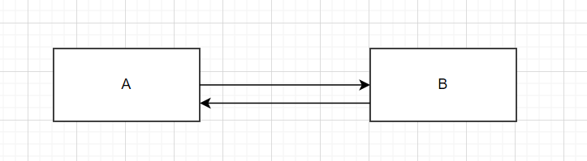
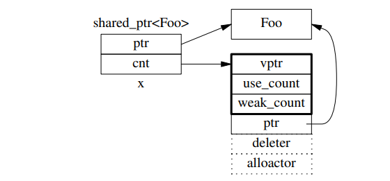
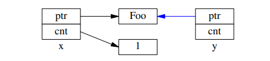
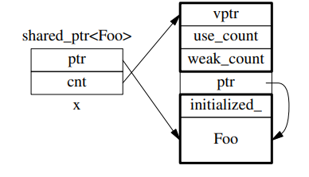

# C++ 智能指针使用和原理分析

本文章主要介绍如下内容：

- C++11 支持的三种不同类型的智能指针：`shared_ptr` 、`weak_ptr`以及`unique_ptr`的区别；
- 探究`std::shared_ptr`底层实现，以及`make_shared`的优势;
- 分析智能指针不恰当使用导致的问题：double free、内存泄漏和线程安全

## 智能指针基本介绍

### shared_ptr

`shared_ptr`体现的是共享所有权，即多个`shared_ptr`共享所指向对象的所有权，当且仅当所有的`shared_ptr`均被析构时，所指向的对象才会被析构释放。

观察如下代码，在`shared_ptr`构造、赋值、退出作用域时，会对引用计数`use_count`进行加一、减一。当减为0时，会调用`delete`析构并释放所指向的对象：

```cpp
void test() {
  std::shared_ptr<Widget> pw1(new Widget); // use_count = 1
  std::shared_ptr<Widget> pw2 = pw1; // use_count = 2
  // ...
  // 退出pw1和pw2所在作用域，pw1，pw2先后被析构，use_count减为0,调用delet析
  // 构并释放所指向的Widget对象
}
```

在 C++11 时，尚且只支持对象类型，只能通过自定义删除器，来实现对数组的支持。而在 C++ 17 之后，便支持了数组类型。

```cpp
// 方法一
std::shared_ptr<int> sp3(new int[10](),[](int *p){ delete []p; });
// 方法二
std::shared_ptr<int> sp3 = make_shared<int>(new int[10](),[](int *p){ delete []p; });
// 方法三：C++17之后
std::shared_ptr<int[]> sp3(new int[10]());
int i = sp3[2];
```

### weak_ptr

`weak_ptr`不负责对象的生命周期管理，它指向一个由`shared_ptr`管理的对象，但不会改变引用计数。通过`lock()`来判断所指的对象是否存在，若存在则返回一个`shared_ptr`，否则为`nullptr`。

`weak_ptr`的引入主要是为了解决循环引用的问题。如下图所示，A中有一个`shared_ptr`指向B，B中也有一个`shared_ptr`指向A。这会导致`use_count`始终不为0，A和B对象始终无法被析构并释放。解决办法，就是将其中的一个指针改为`weak_ptr`，来破环这种循环引用。



### unique_ptr

不同于`shared_ptr、weak_ptr`，`unique_ptr`独占所指对象的所有权。从某种程度上了说它实现了 RAII 语义，并且零开销。所以如果有独占所指对象的所有权语义的场景，均可用`unique_ptr`而不用担心性能损失。

以下是一个基本示例：

```cpp
// 创建并初始化一个unique_ptr
std::unique_ptr<Widgt> pw = std::make_unique<Widgt>();
// 将所有权移交给pw2
std::unique_ptr<Widgt> pw2 = std::move(pw);
```

## shared_ptr的实现原理

`shared_ptr`是引用计数型智能指针。它包含两个成员指针，一个指向所管理的对象`ptr`，另一个指向堆上的引用计数块`ref_count`。

观察如下的结构示意图。可以观察到`ref_count`中有多个成员，其中`use_count`表示有多少个`shared_ptr`指向对象`Foo`,`weak_count`表示有多少个`shared_ptr or weak_ptr`指向对象`ref_count`。



这里只分析`shard_ptr`和`use_count`。故示意图可以简化为如下所示：


如果再执行`shared_ptr<Foo> y = x;`，那么对应的数据结构如下：


这里可以分为两步：

- 第一步，复制ptr指针，这一步是atomic的。

- 第二步，复制cnt指针，增加use_count，这一步也是atomic的。


## 为什么要尽量使用 make_shared()？

为了节省一次内存分配，原来`shared_ptr<Foo> x(new Foo)`; 需要为 `Foo`和`ref_count`各分配一次内存，现在用`make_shared()`的话，可以一次分配一块足够大的内存，供`Foo`和`ref_count`对象容身。数据结构是：


## 常见问题分析

### double free

在使用了智能指针之后，也是有可能出现double free的。

比如如下代码，它使用相同的内置指针初始化 p1 和 p2。在退出作用域后，会调用两次`delete p`，触发未定义行为，比如`segment fault`错误。

```cpp
Widgt *raw_ptr = new Widgt;
std::shared_ptr<Widgt> p1(raw_ptr); // use_count = 1
std::shared_ptr<Widgt> p2(raw_ptr); // use_count = 1
// ...
// 会出现double free
```

因此，不要使用相同的内置指针初始化或 reset 多个 shared_ptr。

### 内存泄漏

主要是因为循环引用，导致对象不能被析构。具体见上文中的`weak_ptr`章节。

### 为什么多线程读写`shared_ptr`要加锁？

虽然对`ref_count`的读写是原子的，但是对`shared_ptr`中的`ptr`和`cnt`的读写却不是原子的。在多线程下，如果存在多个线程读写同一个`shared_ptr`，就可能存在`race condition`。

因此，如果存在多个线程读写同一个`shared_ptr`，最好使用互斥锁或者自旋锁来保证互斥。

## 参考

[1] 陈硕.Linux 多线程服务器端编程
[2] [shared_ptr](https://cplusplus.com/reference/memory/shared_ptr/)
[3] 陈硕.C++工程实践经验谈第2季
[4] [C++ 智能指针浅析](https://www.cnblogs.com/ljx-null/p/16357131.html)
