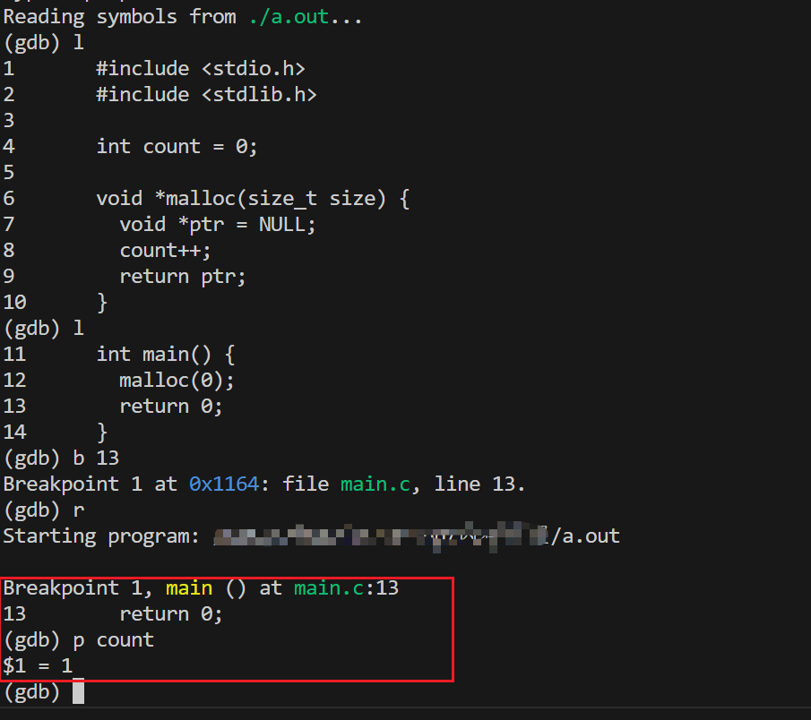

# 内存泄漏详解

## 简介

内存泄漏特指堆上分配的内存没有及时释放。

## 产生原因

1. `malloc / free` 没有成对存在；
2. `new / delete` 没有成对存在；
3. `new[] / delete[]` 没有成对存在。

## 危害

1. 吃掉进程的虚拟内存和系统的物理内存, 造成内存紧张；

## 检测手段

检测内存泄漏有以下难点：

1. 如何判断是否发生了内存泄漏。
2. 如何判断代码上面哪一行发生了泄漏；

### hook机制

#### 基本原理

在C语言中，如果你在main.c文件中定义了一个与标准库中同名的普通函数，比如malloc，那么这个定义会覆盖标准库中的同名函数。C语言的编译器会按照以下顺序查找函数的定义：

1. 首先查找当前源文件中是否有函数的定义。如果在main.c中定义了malloc函数，编译器会使用main.c中的定义。

2. 如果当前源文件中没有找到函数的定义，编译器会查找已经包含的头文件中是否有函数的定义。标准库函数通常在标准库的头文件中声明，例如，malloc函数在<stdlib.h>头文件中声明。如果你的main.c包含了<stdlib.h>头文件，并且在main.c中定义了malloc函数，那么它会覆盖标准库中的定义。

3. 如果在当前源文件和包含的头文件中都没有找到函数的定义，编译器会报错，因为它无法找到函数的实现。

以下是一个简单的示例。在这个示例中，我们定义了自己的malloc，根据上述编译器规则，代码将会调用自定义的malloc。

```c
#include <stdio.h>
#include <stdlib.h>

int count = 0;

void *malloc(size_t size) {
  void *ptr = NULL;
  count++;
  return ptr;
}
int main() {
  malloc(0);
  return 0;
}
```

我们通过 gdb 观察了代码执行情况，发现 `count = 1`。验证了上述分析结果。


其实除了重定义malloc，我们也可以通过宏函数达到一样的效果。相比于普通函数，宏函数是在预处理阶段将malloc调用替换为用户自定义的malloc_hook函数。

要想检测是否发生泄漏，我们可以这样设计：在每次调用malloc时，count加一; 调用free时,count减一。但是这种方法仅可以知道是否发生了泄漏，但不能判断代码中哪一行导致的泄漏。

为此，我们可以这样进行设计：

- 在调用 malloc 时，根据分配地址生成一个`.mem`文件（`sprintf(buff, "./mem/%p.mem", ptr);`），并将调用malloc 的位置（file + line）写入文件；
- 在调用 free 时，再根据地址删除该文件。

这样一来，在运行结束后，我们观察是否存在`.mem`文件，就可以判断是否发生了内存泄漏。通过查看`.mem`文件，就可以判断出代码中哪一行发生了泄漏。

当然除了写文件，你可以通过写内存缓冲的方式。因为与写文件类似，这里不再讨论。

#### 代码实现

先看一下完整的代码实现。这里我们采用了以下手段：

- 使用宏函数来重定向malloc的调用；
- 使用dlsym来获取标准库中的malloc地址；
- 使用 `__FILE__` 和 `__LINE__`来获取调用malloc所在的文件和行；
- 在调用malloc时，根据分配地址创建文件；在free时，删除对应的文件；
- 使用`#ifdef DEBUG #endif` 来区分debug版和release版。

```c
// filename: test.c
#define _GNU_SOURCE
#include <dlfcn.h>
#include <stdio.h>
#include <stdlib.h>
#include <unistd.h>

#ifdef DEBUG

#define MEM_CONTENT_LENGTH 100

#define malloc(size) malloc_hook(size, __FILE__, __LINE__)
#define free(p) free_hook(p, __FILE__, __LINE__)

// 原始的 malloc 函数
void *(*original_malloc)(size_t size) = NULL;
void *(*original_free)(void *p) = NULL;
// malloc hook 函数
void *malloc_hook(size_t size, const char *file, int line);
void free_hook(void *p, const char *file, int line);

void init_hook() {
  // 如果原始 malloc 函数尚未初始化，初始化它
  if (!original_malloc) {
    original_malloc = dlsym(RTLD_NEXT, "malloc");
  }
  // 如果原始 free 函数尚未初始化，初始化它
  if (!original_free) {
    original_free = dlsym(RTLD_NEXT, "free");
  }
}

#endif

int main() {
#ifdef DEBUG
  init_hook();
#endif
  // 使用 malloc 分配内存
  int *arr = (int *)malloc(5 * sizeof(int));

  // 为了演示效果，简单地初始化数组元素并释放内存
  for (int i = 0; i < 5; i++) {
    arr[i] = i * 2;
  }

  // 打印数组元素
  printf("Array elements: ");
  for (int i = 0; i < 5; i++) {
    printf("%d ", arr[i]);
  }
  printf("\n");

  // 释放内存
  // free(arr);

  return 0;
}

#ifdef DEBUG
// 重定向的 malloc 函数
void *malloc_hook(size_t size, const char *file, int line) {
  void *ptr = original_malloc(size);
  char buff[MEM_CONTENT_LENGTH] = {0};
  sprintf(buff, "./mem/%p.mem", ptr);

  FILE *fp = fopen(buff, "w");

  fprintf(fp, "[%s:%d]malloc --> addr: %p\n", file, line, ptr);
  // printf("[%s:%d]malloc --> addr: %p\n", file, line, ptr);
  fflush(fp);
  return ptr;
}

void free_hook(void *p, const char *file, int line) {
  char buff[MEM_CONTENT_LENGTH] = {0};
  sprintf(buff, "./mem/%p.mem", p);
  if (unlink(buff) < 0) {
    printf("double free: %p\n", p);
  }
  original_free(p);
}

#endif
```

这里给出通过gcc来编译debug版和release版的命令：

- debug: gcc test.c -g -DDEBUG -ldl
- release: gcc test.c

以上就是使用hook机制来检测内存泄漏的具体内容。

### valgrind

valgrind是一个非常强大的工具。检测内存泄漏仅是其功能之一。

Valgrind检测内存泄漏时通常会报告不同类型的泄漏，这些泄漏类型有助于您更好地理解问题并采取适当的措施。以下是Valgrind常见的内存泄漏类型：

1. **Definitely Lost (直接泄漏)**:
   表示程序明确发生了内存泄漏。这通常是因为在程序结束前未释放已分配的内存。具体示例如下：

   ```cpp
   #include <iostream>

   int main() {
      int* arr = new int[10];  // 分配一个整数数组

      // 程序结束前忘记释放内存
      // delete[] arr;

      return 0;
   }
   ```

2. **Indirectly Lost (间接泄漏)**:
   “Indirectly Lost”意味着你的程序正在基于指针的数据结构中泄漏内存。例如，如果二叉树的根节点“Definitely Lost”，则所有子节点都会“Indirectly Lost”。如果你修复了“Definitely Lost”的泄漏，那么“Indirectly Lost”的泄漏应该消失。以下给出个具体示例。

   ```cpp
   #include <iostream>

   class Node {
    public:
      int data;
      Node* left;
      Node* right;

      Node(int val) : data(val), left(nullptr), right(nullptr) {}
   };

   int main() {
      Node* root = new Node(5);  // 分配一个根节点

      // 创建子节点
      root->left = new Node(3);
      root->right = new Node(7);

      // 在子节点上创建更多节点
      root->left->left = new Node(2);
      root->left->right = new Node(4);

      // 程序结束前忘记释放内存
      // delete root;

      return 0;
   }
   ```

3. **Possibly Lost (可能泄漏)**:
   "Possibly Lost" 意味着您的程序存在内存泄漏的可能性，除非您在指针上执行了一些不寻常的操作，可能导致指针指向已分配块的中间位置。使用 --show-possibly-lost=no 可以禁止显示这些报告，但通常情况下，建议查看并修复可能泄漏。

4. **Still Reachable (仍然可达)**:
   "Still Reachable" 意味着您的程序可能没有释放一些内存，但这些内存仍然可以被访问。这是比较常见的情况，通常是合理的。您可以使用 --show-reachable=yes 来查看这些报告，但通常情况下，它们不需要立即处理。

5. **Suppressed (抑制)**:
   "Suppressed" 意味着泄漏错误已经被抑制，通常是由于Valgrind的默认抑制规则。您可以忽略这些已抑制的错误，除非您知道它们是有意的或特定情况下需要处理的。

检测到的泄漏类型通常伴随有详细的报告，包括泄漏的内存地址、分配的位置、泄漏的大小和堆栈跟踪信息，这些信息有助于您定位和解决问题。

要记住，Valgrind只是一个工具，它可以检测内存泄漏，但您仍然需要仔细分析报告并修改程序代码以修复泄漏。修复泄漏通常涉及到在合适的地方释放动态分配的内存，以确保资源得到正确的管理。

## 参考

[1] [使用 Valgrind 检测 C++ 内存泄漏](<http://senlinzhan.github.io/2017/12/31/valgrind/> )
[2] [Valgrind Frequently Asked Questions](https://valgrind.org/docs/manual/faq.html#faq.deflost)
