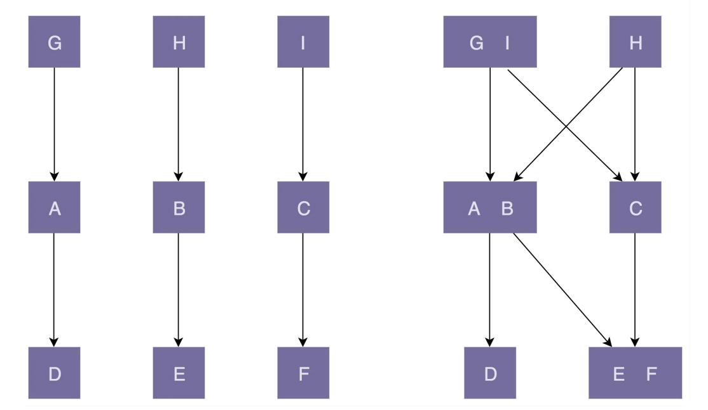

# 设计原则详解

## 单一职责原则

### 如何理解单一职责原则

单一职责原则的英文是 Single Responsibility Principle，缩写为 SRP。这个原则的英文描述是这样的：A class or module should have a single responsibility。如果我们把它翻译成中文，那就是：一个类或者模块只负责完成一个职责（或者功能）。

评价一个类的职责是否足够单一，我们并没有一个非常明确的、可以量化的标准，可以说，这是件非常主观、仁者见仁智者见智的事情。实际上，在真正的软件开发中，我们也没必要过于未雨绸缪，过度设计。所以，我们可以先写一个粗粒度的类，满足业务需求。随着业务的发展，如果粗粒度的类越来越庞大，代码越来越多，这个时候，我们就可以将这个粗粒度的类，拆分成几个更细粒度的类。这就是所谓的持续重构。

实际上，不管是应用设计原则还是设计模式，最终的目的还是提高代码的可读性、可扩展性、**复用性**、可维护性等。我们在考虑应用某一个设计原则是否合理的时候，也可以以此作为最终的考量标准。、

## 开闭原则

### 如何理解开闭原则

开闭原则的英文全称是 Open Closed Principle，简写为 OCP。它的英文描述是：software entities (modules, classes, functions, etc.) should be open for extension , but closed for modification。我们把它翻译成中文就是：软件实体（模块、类、方法等）应该“对扩展开放、对修改关闭”。这个描述比较简略，如果我们详细表述一下，那就是，添加一个新的功能应该是，在已有代码基础上扩展代码（新增模块、类、方法等），而非修改已有代码（修改模块、类、方法等）。

软件实体（模块、类、方法等）应该“对扩展开放、对修改关闭”。从定义中，我们可以看出，开闭原则可以应用在不同粒度的代码中，可以是模块，也可以类，还可以是方法（及其属性）。同样一个代码改动，在粗代码粒度下，被认定为“修改”，在细代码粒度下，又可以被认定为“扩展”。

实际上，我们也没必要纠结某个代码改动是“修改”还是“扩展”，更没必要太纠结它是否违反“开闭原则”。我们回到这条原则的设计初衷：只要它没有破坏原有的代码的正常运行，没有破坏原有的单元测试，我们就可以说，这是一个合格的代码改动。

同时，我们要认识到，添加一个新功能，不可能任何模块、类、方法的代码都不“修改”，这个是做不到的。类需要创建、组装、并且做一些初始化操作，才能构建成可运行的的程序，这部分代码的修改是在所难免的。我们要做的是**尽量让修改操作更集中、更少、更上层，尽量让最核心、最复杂的那部分逻辑代码满足开闭原则**。

### 扩展性和成本如何权衡

即便我们对业务、对系统有足够的了解，那也不可能识别出所有的扩展点，即便你能识别出所有的扩展点，为这些地方都预留扩展点，这样做的成本也是不可接受的。我们没必要为一些遥远的、不一定发生的需求去提前买单，做过度设计。最合理的做法是，对于一些比较确定的、短期内可能就会扩展，或者需求改动对代码结构影响比较大的情况，或者实现成本不高的扩展点，在编写代码的时候之后，我们就可以事先做些扩展性设计。但对于一些不确定未来是否要支持的需求，或者实现起来比较复杂的扩展点，我们可以等到有需求驱动的时候，再通过重构代码的方式来支持扩展的需求。

## 里氏替换原则

### 如何理解里氏替换原则

里式替换原则的英文翻译是：Liskov Substitution Principle，缩写为 LSP。这个原则最早是在1986 年由 Barbara Liskov 提出，他是这么描述这条原则的：

```text
If S is a subtype of T, then objects of type T may be replaced with objects of type S, without breaking the program。
```

在 1996 年，Robert Martin 在他的 SOLID 原则中，重新描述了这个原则，英文原话是这样的：

```text
Functions that use pointers of references to base classes must be able to use objects of
derived classes without knowing it。
```

我们综合两者的描述，将这条原则用中文描述出来，是这样的：子类对象引用能够替换程序中父类对象引用出现的任何地方，并且保证原来程序的逻辑行为不变及正确性不被破坏。

### 与多态的区别

从定义描述和代码实现上来看，多态和里式替换有点类似，但它们关注的角度是不一样的。多态是面向对象编程的一大特性，也是面向对象编程语言的一种语法。它是一种代码实现的思路。而里式替换是一种设计原则，是用来指导继承关系中子类该如何设计的，子类的设计要保证在替换父类的时候，不改变原有程序的逻辑以及不破坏原有程序的正确性。

### 哪些代码明显违背了LSP

实际上，里式替换原则还有另外一个更加能落地、更有指导意义的描述，那就是“Design By Contract”，中文翻译就是“按照协议来设计”。子类在设计的时候，要遵守父类的行为约定（或者叫协议）。父类定义了函数的行为约定，那子类可以改变函数的内部实现逻辑，但不能改变函数原有的行为约定。

这里的行为约定包括：

- 函数声明要实现的功能；
- 对输入、输出、异常的约定；
- 甚至包括注释中所罗列的任何特殊说明。

实际上，定义中父类和子类之间的关系，也可以替换成接口和实现类之间的关系。

## 接口隔离原则

### 如何理解接口隔离原则

接口隔离原则的英文翻译是“ Interface Segregation Principle”，缩写为 ISP。Robert Martin在 SOLID 原则中是这样定义它的：“Clients should not be forced to depend upon interfaces that they do not use。”直译成中文的话就是：客户端不应该被强迫依赖它不需要的接口。其中的“客户端”，可以理解为接口的调用者或者使用者。

在软件开发中，我们既可以把它看作一组抽象的约定，也可以具体指系统与系统之间的 API 接口，还可以特指面向对象编程语言中的接口等。

理解接口隔离原则的关键，就是理解其中的“接口”二字。在这条原则中，我们可以把“接口”理解为下面三种东西：

- 一组 API 接口集合。在设计微服务或者类库接口的时候，如果部分接口只被部分调用者使用，那我们就需要将这部分接口隔离出来，单独给对应的调用者使用，而不是强迫其他调用者也依赖这部分不会被用到的接口。
- 单个 API 接口或函数。那接口隔离原则就可以理解为：函数的设计要功能单一，不要将多个不同的功能逻辑在一个函数中实现。相反，我们就需要把函数拆分成粒度更细的多个函数，让调用者只依赖它需要的那个细粒度函数。
- OOP 中的接口概念。接口的设计要尽量单一，不要让接口的实现类和调用者，实现或者依赖不需要的接口函数。

### 接口隔离原则与单一职责原则的区别

单一职责原则针对的是模块、类、接口的设计。而接口隔离原则相对于单一职责原则，一方面它更侧重于接口的设计，另一方面它的思考的角度（接口使用者）不同。它提供了一种判断接口是否职责单一的标准：通过调用者如何使用接口来间接地判定。如果调用者只使用部分接口或接口的部分功能，那接口的设计就不够职责单一。

## 依赖反转原则

### 控制反转

控制反转的英文翻译是 Inversion Of Control，缩写为 IOC。“控制”指的是对程序执行流程的控制，而“反转”指的是在没有使用框架之前，程序员自己控制整个程序的执行。在使用框架之后，整个程序的执行流程可以通过框架来控制。流程的控制权从程序员“反转”到了框架。

下面是一段测试代码。在没有使用测试框架之前，用户自己编写doTest()，自己去调用doTest()。也就是程序的控制权在用户手中。

```cpp

static bool doTest() {
    // ...
}

int main(void) {
    if (doTest()) {
        printf("Test succeed.");
    } else {
        printf("Test failed.");
    }
    return  0;
}
```

假设使用了如下的测试框架。TestCase是一个抽象类，用户在使用时需继承并实现doTest()方法。JunitApplication负责整个测试流程的执行。

```cpp
/*测试框架*/
class TestCase {
public:
    void run() {
        if (doTest()) {
            printf("Test succeed.");
        } else {
            printf("Test failed.");
        }        
    }

private:
    virtual bool doTest() = 0;
};

class JunitApplication {
public:
    static void register(const TestCase &testcase) {
        testcases.push(testcase);
    }

    static void runAll() {
        for (auto &it : testcases) {
            it.run();
        }
    }
private:
    static std::queue<TestCase> testcases;
};

/*测试框架的简单使用*/

// 继承TestCase，实现doTest()
class UserServiceTest : public TestCase {
public:
    bool doTest() override ;
};

bool UserServiceTest::doTest() {
    // ... 
}


int main(void) {
    JunitApplication uintApp;
    uinitApp.register(new UserServiceTest);

    unit.runAll();
}
```

在使用了测试框架之后，测试的整体执行流程将由测试框架的runAll来控制。这就实现了将执行流程的控制权从原来的用户控制，过度到了由框架控制。显然，只要你使用了框架，就会将控制权交给框架。带来的好处就是极大的加速了开发效率。

### 依赖注入(DI)

依赖注入的英文翻译是 Dependency Injection，缩写为 DI。那到底什么是依赖注入呢？我们用一句话来概括就是：不通过 new() 的方式在类内部创建依赖类对象，而是将依赖的类对象在外部创建好之后，通过构造函数、函数参数等方式传递（或注入）给类使用。

## 依赖反转原则(DIP)

依赖反转原则的英文翻译是 Dependency Inversion Principle，缩写为 DIP。中文翻译有时候也叫依赖倒置原则。为了追本溯源，我先给出这条原则最原汁原味的英文描述：

```text
High-level modules shouldn’t depend on low-level modules. Both modules should depend on abstractions. In addition, abstractions shouldn’t depend on details. Details depend on abstractions.
```

大概意思就是：高层模块（high-level modules）不要依赖低层模块（low-level）。高层模块和低层模块应该通过抽象（abstractions）来互相依赖。除此之外，抽象（abstractions）不要依赖具体实现细节（details），具体实现细节（details）依赖抽象（abstractions）。

所谓高层模块和低层模块的划分，简单来说就是，在调用链上，调用者属于高层，被调用者属于低层。在平时的业务代码开发中，高层模块依赖底层模块是没有任何问题的。实际上，这条原则主要还是用来**指导框架层面的设计**。

## 其他原则

### KISS 原则

Keep It Simple and Stupid. 翻译成中文就是：尽量保持简单。

不过，这条原则只是告诉我们，要保持代码“Simple and Stupid”，但并没有讲到，什么样的代码才是“Simple and Stupid”的，更没有给出特别明确的方法论，来指导如何开发出“Simple and Stupid”的代码。

#### 代码行数越少就越简单吗？

逻辑复杂度、实现难度、代码的可读性。

#### 代码逻辑复杂就违背KISS原则吗？

处于性能方面的考虑，有时必须采用逻辑复杂的算法。这时算法本身具有逻辑复杂、实现难度大、可读性差的特点，比如KMP。本身就复杂的问题，用复杂的方法解决，并不违背 KISS 原则。

#### 如何写出满足KISS原则的代码？

以下给出一些具体的建议：

- 不要使用同事可能不懂的技术来实现代码。比如前面例子中的正则表达式，还有一些编程语言中过于高级的语法等。
- 不要重复造轮子，要善于使用已经有的工具类库。经验证明，自己去实现这些类库，出 bug 的概率会更高，维护的成本也比较高
- 不要过度优化。不要过度使用一些奇技淫巧（比如，位运算代替算术运算、复杂的条件语句代替 if-else、使用一些过于底层的函数等）来优化代码，牺牲代码的可读性。

实际上，代码是否足够简单是一个挺主观的评判。同样的代码，有的人觉得简单，有的人觉得不够简单。而往往自己编写的代码，自己都会觉得够简单。所以，评判代码是否简单，还有一个很有效的间接方法，那就是 code review。如果在 code review 的时候，同事对你的代码有很多疑问，那就说明你的代码有可能不够“简单”，需要优化啦。

### YAGNI 原则

YAGNI 原则的英文全称是：You Ain’t Gonna Need It。直译就是：你不会需要它。这条原则也算是万金油了。当用在软件开发中的时候，它的意思是：不要去设计当前用不到的功能；不要去编写当前用不到的代码。实际上，这条原则的核心思想就是：不要做过度设计。

比如，我们的系统暂时只用 Redis 存储配置信息，以后可能会用到 ZooKeeper。根据 YAGNI原则，在未用到 ZooKeeper 之前，我们没必要提前编写这部分代码。当然，这并不是说我们就不需要考虑代码的扩展性。我们还是要预留好扩展点，等到需要的时候，再去实现 ZooKeeper 存储配置信息这部分代码。

KISS 原则讲的是“如何做”的问题（尽量保持简单），而 YAGNI 原则说的是“要不要做”的问题（当前不需要的就不要做）。

### DRY原则

DRY 原则。它的英文描述为：Don’t Repeat Yourself。中文直译为：不要重复自己。将它应用在编程中，可以理解为：不要写重复的代码。

你可能会觉得，这条原则非常简单、非常容易应用。只要两段代码长得一样，那就是违反 DRY原则了。真的是这样吗？答案是否定的。这是很多人对这条原则存在的误解。实际上，重复的代码不一定违反 DRY 原则，而且有些看似不重复的代码也有可能违反 DRY 原则。

下面主要讲三种典型的代码重复情况，它们分别是：实现逻辑重复、功能语义重复和代码执行重复。这三种代码重复，有的看似违反 DRY，实际上并不违反；有的看似不违反，实际上却违反了。

- 实现逻辑重复：两个函数的实现逻辑目前完全一致，但功能不同，并不违反 DRY 原则。因为两个函数的实现逻辑在未来可能会变动。
- 功能语义重复：无论两个函数的实现逻辑是否相同，只要功能语义相同，则违反 DRY 原则。但是出于性能和使用场景不同，在一定程度上，可以违反 DRY 原则。
- 代码执行重复：重复的功能代码执行了两次，违反 DRY 原则。

### 迪米特法则(LOD)

#### 何为高内聚，低耦合？

高内聚是指一个模块或组件内部的各个元素（函数、类、模块等）彼此之间相关性很强，共同完成一个明确的任务或目标。低耦合是指模块或组件之间的相互依赖性较低，它们之间的联系和交互尽可能地减少。

实际上，“高内聚、松耦合”是一个比较通用的设计思想，可以用来指导不同粒度代码的设计与开发，比如系统、模块、类，甚至是函数，也可以应用到不同的开发场景中，比如微服务、框架、组件、类库等。能够有效提高代码的可读性和可维护性，缩小功能改动导致的代码改动范围。

为了方便我讲解，接下来我以“类”作为这个设计思想的应用对象来展开讲解，其他应用场景你可以自行类比。

在这个设计思想中，“高内聚”用来指导类本身的设计，“松耦合”用来指导类与类之间依赖关系的设计。不过，这两者并非完全独立不相干。高内聚有助于松耦合，松耦合又需要高内聚的支持。

所谓高内聚，就是指相近的功能应该放到同一个类中，不相近的功能不要放到同一个类中。相近的功能往往会被同时修改，放到同一个类中，修改会比较集中，代码容易维护。实际上，我们前面讲过的单一职责原则是实现代码高内聚非常有效的设计原则。

所谓松耦合是说，在代码中，类与类之间的依赖关系简单清晰。即使两个类有依赖关系，一个类的代码改动不会或者很少导致依赖类的代码改动。实际上，我们前面讲的接口隔离、基于接口而非实现编程，以及今天讲的迪米特法则，都是为了实现代码的松耦合。



图中左边部分的代码设计中，类的粒度比较小，每个类的职责都比较单一。相近的功能都放到了一个类中，不相近的功能被分割到了多个类中。这样类更加独立，代码的内聚性更好。因为职责单一，所以每个类被依赖的类就会比较少，代码低耦合。一个类的修改，只会影响到一个依赖类的代码改动。我们只需要测试这一个依赖类是否还能正常工作就行了。

图中右边部分的代码设计中，类粒度比较大，低内聚，功能大而全，不相近的功能放到了一个类中。这就导致很多其他类都依赖这个类。当我们修改这个类的某一个功能代码的时候，会影响依赖它的多个类。我们需要测试这三个依赖类，是否还能正常工作。这也就是所谓的“牵一发而动全身”。

除此之外，从图中我们也可以看出，高内聚、低耦合的代码结构更加简单、清晰，相应地，在可维护性和可读性上确实要好很多。

#### 迪米特原则

迪米特法则的英文翻译是：Law of Demeter，缩写是 LOD。单从这个名字上来看，我们完全猜不出这个原则讲的是什么。不过，它还有另外一个更加达意的名字，叫作最小知识原则，英文翻译为：The Least Knowledge Principle。
关于这个设计原则，我们先来看一下它最原汁原味的英文定义：

```text
Each unit should have only limited knowledge about other units: only units “closely” related to the current unit. Or: Each unit should only talk to its friends; Don’t talk to strangers.
```

我们把它直译成中文，就是下面这个样子：

```text
每个模块（unit）只应该了解那些与它关系密切的模块的有限知识（knowledge）。或者说，每个模块只和自己的朋
友“说话”（talk），不和陌生人“说话”（talk）。
```

如果用类来解释说明这个原则，就是：不该有直接依赖关系的类之间，不要有依赖；有依赖关系的类之间，尽量只依赖必要的接口（也就是定义中的“有限知识”）。迪米特法则是希望减少类之间的耦合，让类越独立越好。每个类都应该少了解系统的其他部分。一旦发生变化，需要了解这一变化的类就会比较少。
